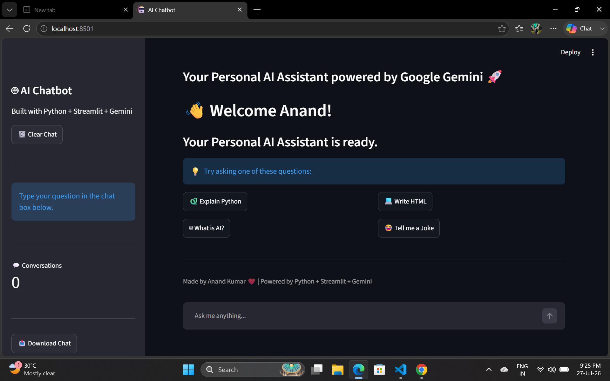

# 🤖 AI Chatbot

A modern AI Chatbot built using **Python**, **Streamlit**, and **Google Gemini AI**.

## 🚀 Features

- 🤖 Google Gemini AI
- 💬 Interactive Chat Interface
- 📝 Chat History
- 👤 User & AI Avatars
- 🗑️ Clear Chat
- 📥 Download Chat
- ⏳ Thinking Animation
- 📊 Message Counter
- 📱 Responsive UI

## 🛠️ Technologies Used

- Python
- Streamlit
- Google Gemini API
- python-dotenv

## 📂 Project Structure

```
AI_Chatbot/
│── app.py
│── chatbot.py
│── requirements.txt
│── .env
│── .gitignore
│── README.md
```

## ⚙️ Installation

```bash
git clone <repository-url>
cd AI_Chatbot
pip install -r requirements.txt
streamlit run app.py
```
## 📸 Screenshot



## 👨‍💻 Author

**Anand Kumar**
